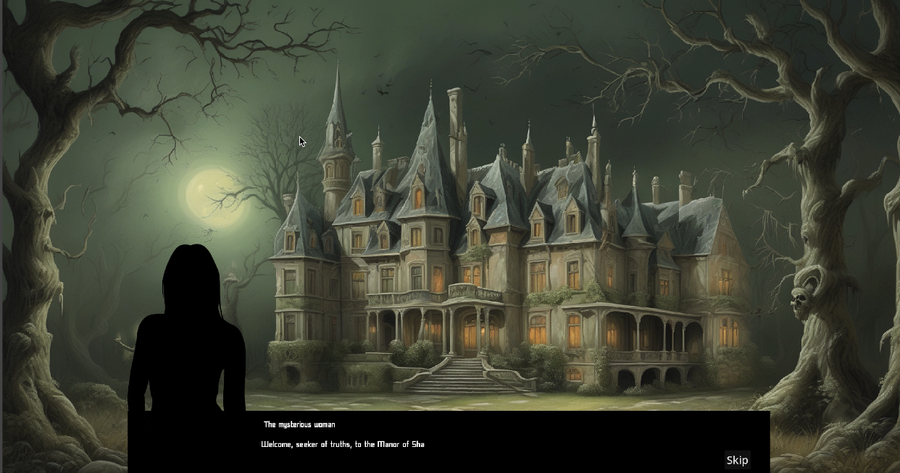
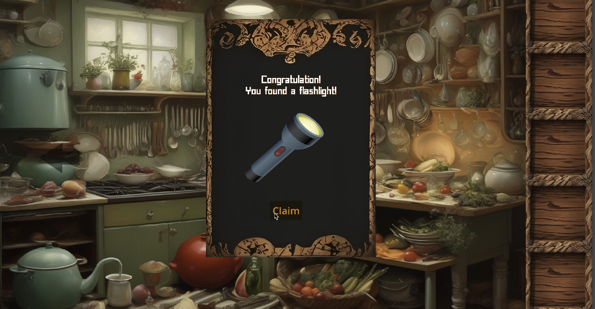
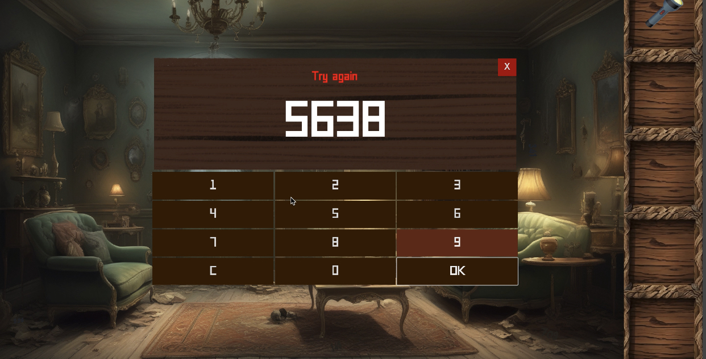
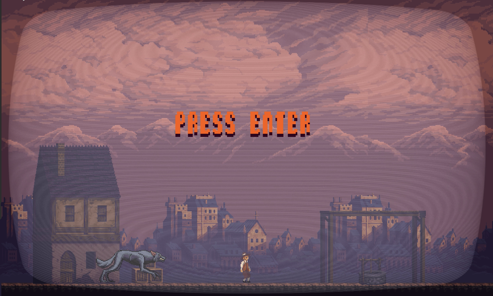

# Project Name: The Haunted Manor

 
## Description
"The Haunted Manor" is an immersive adventure puzzle game set in a mysterious and chilling mansion. Players navigate through a series of challenges, uncovering secrets and solving puzzles to escape the mansion's grip.

 

## Features
- Over 20 interactive puzzles and narrative elements developed using GDScript within the Godot game engine.
- Implementation of AI-driven tools for procedural content generation, ensuring dynamic game assets and streamlining production processes.
- Efficient management of over 500 project assets using version control systems like GitHub.
- Resulted in a polished escape room game with a player retention rate of over 80%.

  

## How to Play
1. Download or clone the repository to your local machine.
2. Open the project in the Godot game engine.
3. Run the game and embark on a thrilling adventure through the haunted mansion.
4. Solve puzzles, uncover secrets, and escape the mansion's grasp.

## Coming Soon
Stay tuned for the release of the iOS and Android app versions of "The Haunted Manor" for on-the-go gaming thrills!

## Contributing
We welcome contributions from developers, designers, and enthusiasts alike. Feel free to fork the repository, make improvements, and submit pull requests. Together, we can continue to enhance the gaming experience for players worldwide.

## Credits
- Developed by Quinxie Doan
- Special thanks to professor Stonedahl and CSC 380 class for their invaluable contributions.

## Feedback
We value your feedback! If you encounter any issues or have suggestions for improvement, please don't hesitate to open an issue or reach out to us directly.

Thank you for your interest in "The Haunted Manor"! We hope you enjoy playing as much as we enjoyed developing it.
